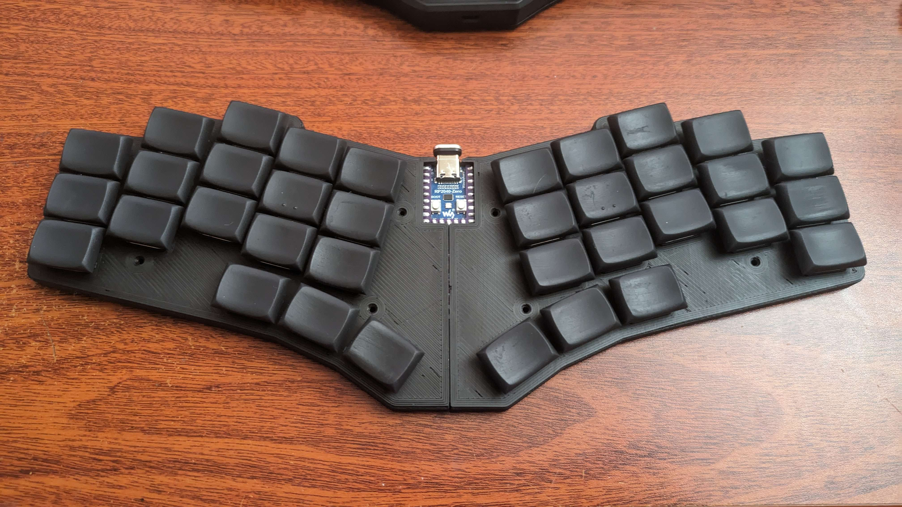

# Bad Wings: **Bold**
Oops! All 1.25u!

# Features
* 36key, "choc spaced", all 1.25u
* RP2040-Zero

# Materials
* 1x RP2040-zero
* 36x Choc v1 Switches
* 36x SOD-123 1N4148 Diodes
* 36x Hotswap Sockets (optional)

# Build Guide
* Install Diodes
* Install RP2040-zero (buttons facing up)
* Flash [Firmware](FIRMWARE.md)
* Test Matrix
  * use metal tweezers to short the connections for each switch on the PCB
* If matrix works, install switches
  * Hotswap Sockets optional
  * ALso mill-maxable
* Done

## SUPPORT

---

<a property="dct:title" rel="cc:attributionURL" href="https://github.com/hazels-garage/bad-wings/tree/master/bold">Bad Wings: Bold</a> by <a rel="cc:attributionURL dct:creator" property="cc:attributionName" href="https://github.com/jasonhazel">Jason Hazel</a> is licensed under <a href="http://creativecommons.org/licenses/by/4.0/?ref=chooser-v1" target="_blank" rel="license noopener noreferrer" style="display:inline-block;">CC BY 4.0</a>
