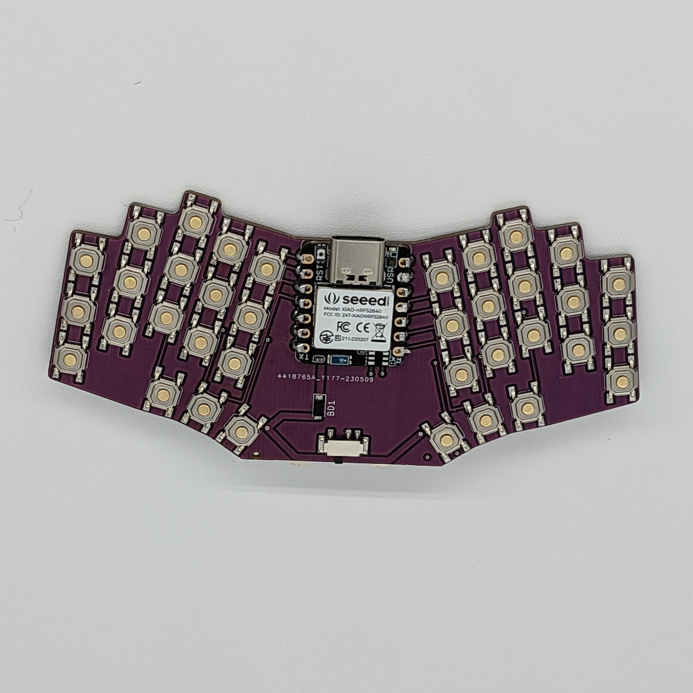

# Bad Wings: Go
Wireless "Pocket" "Sized" "Ergonomic" "Keyboard"

# Features
* 36 key, 4x4mm switches.
* It's really small
* No diodes, so don't try to type fast
* Fits in a wallet that's slightly larger than a normal wallet.
* Could be used as a keychain, I guess.
* [Open Source](source/)

## Materials
* 1x XIAO BLE
* 1x SOD-123 1N4148 Diode
* 36x SKQGAFE010 TACT Switch
* 1x MSK-12C02 Power Switch
* 1x [CR2032 Battery Holder](https://www.aliexpress.us/item/2251832843180857.html)
## Build Guide
* Solder switches
* Solder XIAO
  * Surface mounted on top of PCB
  * Solder BAT and NFC pads from back of PCB
* Flash [firmware](FIRMWARE.md)
* Solder CR2032 holder
* Solder battery diode
* Solder Power Switch
* Insert Battery
* Done
