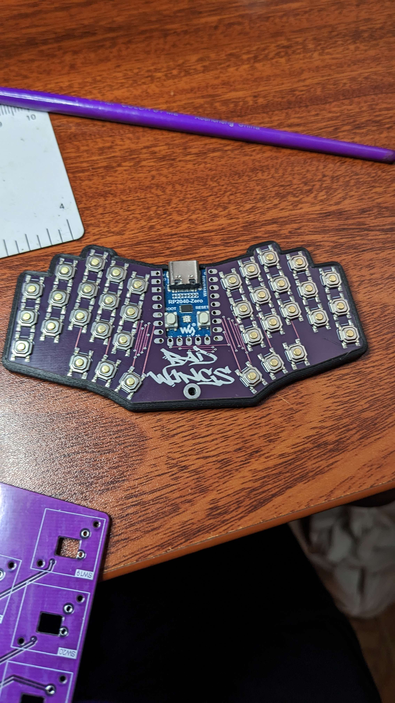

# Bad Wings: Pocket
"Pocket" "Sized" "Ergonomic" "Keyboard"

# Features
* 36 key, 4x4mm switches.
* It's really small
* No diodes, so don't try to type fast
* Fits in a wallet that's slightly larger than a normal wallet.
* Could be used as a keychain, I guess.
* [Open Source](source/)
## Cases
[Pressfit](cases/pressfit.stl)

## Materials
* 1x Waveshare RP2040-Zero
* 36x SKQGAFE010 TACT Switch

## Build Guide
* Solder switches
* Solder RP2040-zero
* Flash [firmware](FIRMWARE.md)
* Done
