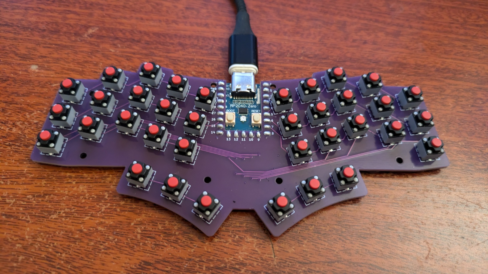

# Bad Wings 2: Pocket 
"Pocket" "Sized" "Ergonomic" "Keyboard"

# Features
* 36 key, "mouse" switches.
* It's really small
* HAS DIODES!
* Fits in a wallet that's slightly larger than a normal wallet.
* Could be used as a keychain, I guess.
* [Open Source](source/)
## Cases
[Top](case/top.step)
[Bottom](case/bottom.step)

## Materials
* 1x Waveshare RP2040-Zero
* 36x "Kailh Mute Button 6x6x7.3 Silent Mouse Switch"
* 36x SOD-123 Diodes

## Build Guide
* Solder diodes
* Solder switches
* Solder RP2040-zero
* Flash [firmware](FIRMWARE.md)
* Done

### Warning
I slapped together this documentation so there is a good chance I've overlooked something.  Find me on Discord if you need help.
