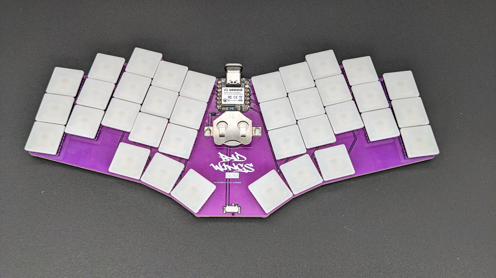
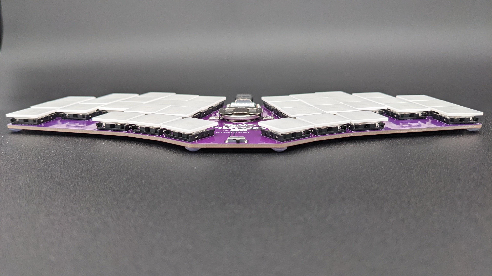

# Bad Wings: Slim
Ultrathin, wireless Bad Wings.

# Features
* 36 key, Kailh XSwitches.
* Less than a cm tall.
* Bluetooth via XIAO BLE
* CR2032 Battery
* [Open Source](source/)
* [Gerbers](source/GERBER-bad_wings_slim.zip)

# Materials
* 1x XIAO BLE
* 36x [Kailh XSwitch and Keycaps](https://mkultra.click/kailh-x-switches-and-keycaps/)
* 37x SOD-123 1N4148 Diodes
* 1x MSK-12C02 Power Switch
* 1x [CR2032 Battery Holder](https://www.aliexpress.us/item/2251832843180857.html)

# Build Guide
* Install Diodes
* Solder XIAO
  * Surface mounted on top of PCB
  * Solder BAT and NFC pads from back of PCB
* Flash [Firmware](FIRMWARE.md)
* Test matrix works 
  * use metal tweezers to short the connections for each switch on the PCB
* If matrix works, install switches
  * place the switches and then tape them in place
  * flip board over, solder switches
  * _I install the switches a column at a time but, you do you._
* Solder CR2032 holder
* Solder battery diode
* Solder Power Switch
* Insert Battery
* Done

## SUPPORT

---

<a property="dct:title" rel="cc:attributionURL" href="https://github.com/jasonhazel/kurp">Bad Wings: Slim</a> by <a rel="cc:attributionURL dct:creator" property="cc:attributionName" href="https://github.com/jasonhazel">Jason Hazel</a> is licensed under <a href="http://creativecommons.org/licenses/by/4.0/?ref=chooser-v1" target="_blank" rel="license noopener noreferrer" style="display:inline-block;">CC BY 4.0</a>

