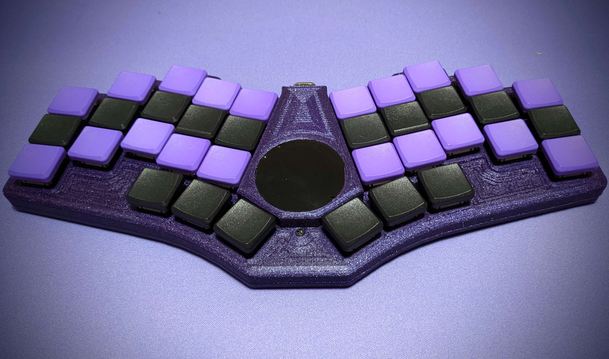

# Bad Wings v1

The original Bad Wings.

# Features

* 36 key, hotswap, choc spaced
* Cirque touchpad
* Gengle splay on ring and pinky columns
* Pre-soldered diodes, shift register and cirque connector
* [Pre-assembled and kits](https://shop.hazel.cc/products/bad-wings)

## Cases
[Original](cases/original/) | [Inset](cases/inset) (Coming Soon)

## Build Guide
* Install Switch Hot Swap Sockets
* Install XIAO Sockets
* Install Pins on XIAO
* Connect ribbon cable to Cirque touchpad
* Connect Cirque to PCB
* Flash [Firmware](FIRMWARE.md)
* Test Cirque and switches
* Disconnect Cirque cable from PCB
* Secure Cirque to top case (dab of hot glue)
* Insert PCB into top case, feed ribbon cable through hole
* 5mm screws through the top of the case and PCB, into standoffs 
* Reconnect ribbon cable to PCB
* 3mm screws through bottom of case into standoffs
* Done.
