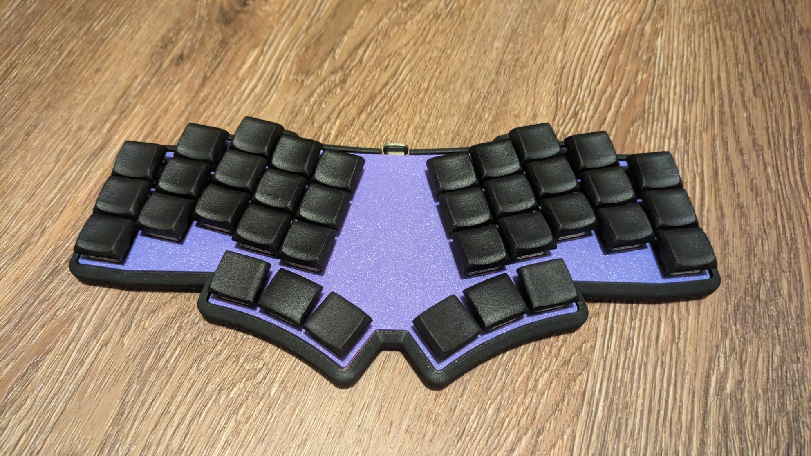

# Bad Wings v2

Improves upon the original by ditching the XIAO and shift register for an onboard STM32 microprocessor, reducing the build time and simplifying kits.

## Features
* 36 key unibody split
* Choc spaced, column staggered layout
* Gentle splay on ring and pinky columns
* Onboard STM32F072
* Cirque touchpad support
* Built in mounting standoffs
* [3D Printed Case](case/)

## Build Summary
* Solder hotswap sockets
* Insert switches into switchplate
* Insert switches into hotswap sockets
* If Cirque
    * Use soldering iron to install heatset inserts into Cirque housing
    * Insert FPC cable into Cirque
      * note: The blue tape side of the cable should face away from the center of the cirque
    * Insert Cirque into housing
      *  Correct orientation should have the ribbon connector facing the thumb switches, and be right over the hole in the PCB
      * A dab or two of hotglue on the underside will help keep it in place.
    * Run FPC cable through Switchplate/PCB
    * Connect FPC to PCB
      * note: the blue tape side of the cable should be facing away from the PCB
* [Flash Firmware](firmware/README.md)
* Insert PCB into bottom case
* Use 8mm countersunk screws through bottom of case into PCB
    * If Cirque, use 12mm countersunk screws to attach housing
* Apply rubber feet to bottom of case
* Enjoy!

